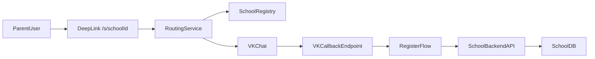

# Multi-school VK Bot (TypeScript)

MVP сервиса для сценария:

1. Пользователь открывает deep link `/s/:schoolId`
2. Сервис перенаправляет в чат нужного школьного VK-бота
3. Бот запрашивает номер телефона
4. Бэкенд школы ищет ученика по телефону
5. Выполняется привязка `vk_user_id -> student_id`

## Варианты реализации `1 школа = 1 бот`

- `Вариант A (рекомендуемый)`: один централизованный сервис, много VK-сообществ (по одному на школу), маршрутизация по `group_id`.
- `Вариант B`: мульти-лонгполл в одном процессе (тоже без 200 процессов), но сложнее эксплуатация и failover.
- `Вариант C`: отдельный процесс на школу, допустим при строгой изоляции/комплаенсе, но операционно дороже.

## Маршрутизация по `schoolId`

- Deep link: `GET /s/:schoolId`
- Lookup в `SchoolRegistry`: `schoolId -> vkGroupId`
- Redirect: `https://vk.com/im?sel=-{vkGroupId}&start={signedRef}`
- На webhook бот определяет школу по `group_id` (источник истины), `start/ref` только как вспомогательный контекст.

## Архитектура MVP (1 школа, но готово к multi-school)



## Структура проекта

- `src/server.ts` — запуск HTTP сервера, маршруты и DI.
- `src/router/deepLinkRouter.ts` — редирект `/s/:schoolId` в VK.
- `src/vk/callbackHandler.ts` — проверка `secret`, обработка `confirmation/message_new`.
- `src/vk/flow/registerFlow.ts` — state machine регистрации.
- `src/domain/phone.ts` — нормализация телефона в E.164.
- `src/integrations/schoolApi.ts` — режимы `mock/http` для API школы.
- `src/repositories/*` — MVP-хранилище сессий и привязок (in-memory).

## Риски и ограничения VK API

- В VK-ботах нет Telegram-подобной нативной кнопки `request_contact`.
- Для отправки сообщений нужен `random_id` (идемпотентность).
- Возможны rate-limit и временные сбои API; нужны retry/backoff.
- Webhook нужно защищать: `secret key`, фильтрация источников, идемпотентная обработка событий.

## Масштабирование до ~200 школ без 200 процессов

- Один stateless сервис в нескольких репликах за балансировщиком.
- Конфигурация школ в БД/registry + кеш.
- Общие очереди для тяжелых операций (`resolve/bind`) с DLQ.
- Централизованные сессии и dedupe событий (Redis/PostgreSQL).
- Пер-школьные лимитеры (VK API и backend школы).
- Наблюдаемость per school: latency, error rate, quota.

## Быстрый старт

1. Скопируйте `.env.example` в `.env`.
2. Заполните `SCHOOLS_JSON` минимум одной школой.
3. Запустите:

```powershell
npm run dev
```

Для MVP можно оставить `SCHOOL_API_MODE=mock`.
